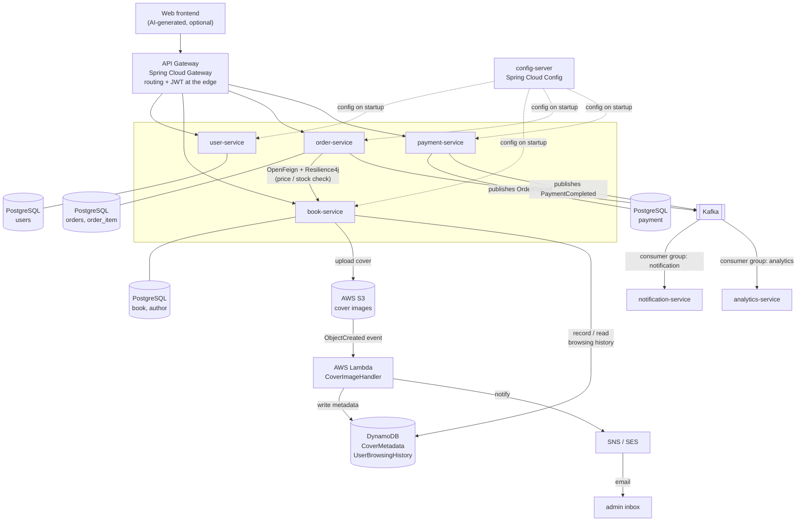

# Architecture

Two views: where the project is **now**, and the **target** it is being built toward. Submission
deliverable #4 is the target diagram.

## Current state (Step 1)

One Spring Boot application, three layers, one in-memory database. Nothing distributed yet.

```mermaid
flowchart LR
    C[curl / Postman] -->|HTTP| CT[BookController]
    CT --> SV[BookService]
    SV --> RP[BookRepository]
    RP --> DB[(H2 in-memory)]
    AOP[LoggingAspect]-.->|@Around| SV
    EH[GlobalExceptionHandler]-.->|@RestControllerAdvice| CT
```

## Target architecture (end of Step 11)



**Cross-cutting, applied to every service:** Spring AOP (logging + timing) · Spring Boot Actuator →
CloudWatch · Docker images → Kubernetes / EKS · GitHub Actions CI/CD.

## How to read this

**Synchronous vs asynchronous.** Solid arrows between services are blocking HTTP calls — order-service
must wait for book-service to answer "is there stock?" before it can accept an order, so that call is
synchronous and needs a timeout and a circuit breaker. Arrows through Kafka are fire-and-forget: the
customer's order does not wait for an email to send or for analytics to update.

**One database per service.** Each service has its own PostgreSQL instance and no other service touches
it. That is what makes services independently deployable — and it is why order-service holds a bare
`book_id` rather than a foreign key (see [D5](decisions.md)).

**Two consumer groups on one topic.** `notification-service` and `analytics-service` subscribe to the
same `OrderPlaced` topic under different consumer group ids, so Kafka delivers every event to *both*.
Adding a third consumer later requires no change to order-service — that is the decoupling payoff.

**Why serverless for covers.** Image processing is bursty (nothing for hours, then a batch upload),
stateless, and short-lived. Paying for an always-on server to do it is waste; Lambda bills per
invocation and scales from zero.

**Why DynamoDB for browsing history.** The access pattern is one key ("give me *this user's* recent
views, newest first") with a very high write rate and no need for joins or ad-hoc queries. That is a
key-value workload, not a relational one — and TTL expires old rows at no cost.
