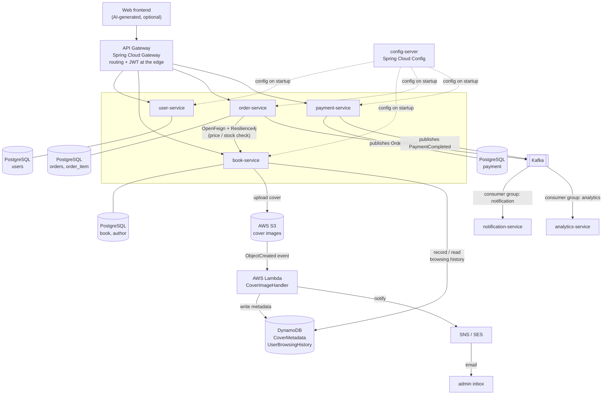
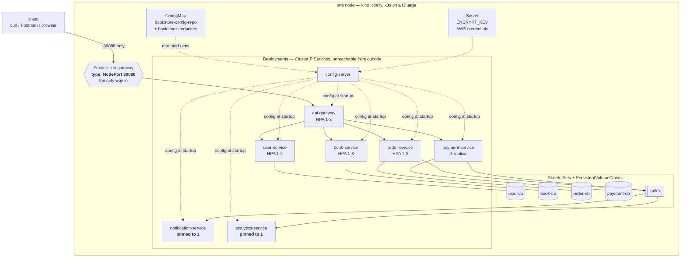
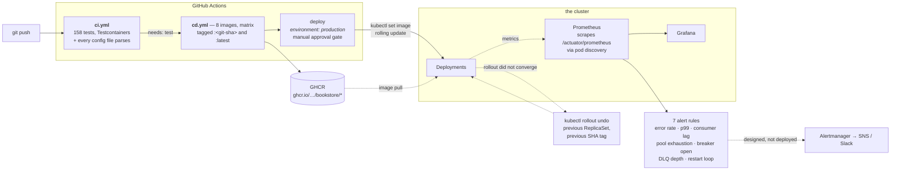

# Architecture

Submission deliverable #4. Three views, because "the architecture" is three different questions:

1. **[What the system is](#1-the-platform)** — services, databases, events, cloud. The logical picture.
2. **[Where it runs](#2-where-it-runs)** — pods, Services, probes, autoscaling. The deployment picture.
3. **[How it gets there and how you know it is alive](#3-how-code-reaches-it-and-how-you-know-it-is-alive)** —
   pipeline and monitoring.

All three are current as of Step 11. The one thing on the first diagram that does not exist is the
frontend: the assignment makes it optional, and the API is exercised with curl and `test-platform.http`.

## 1. The platform

**Cross-cutting, applied to every service:** Spring AOP (logging + timing) · Spring Boot Actuator ·
Spring Cloud Config on startup · a JWT verified independently by every service.

## 2. Where it runs

The same eight services as Kubernetes objects. Everything above is unchanged by this — which is the
point of the picture: **containerisation moved nothing and rewrote nothing.**

**Four things this diagram is asserting, each of which took a step to get right:**

- **One NodePort.** Every other Service is `ClusterIP`, and the gateway's own management port (9090)
  appears in no Service at all — so actuator is unreachable from outside the pod *by construction*
  rather than by a rule somebody could misconfigure. This is Step 8's promise, kept in Step 10c.
- **StatefulSets for the stateful things, and not because of replication.** Each is one replica. A
  Deployment can start a new pod before stopping the old during a rollout, and two PostgreSQL
  processes on one volume is corruption. Kafka has a second reason: a client must reach the *specific*
  broker leading its partition, so a load-balancing Service in front of brokers is wrong in a way that
  looks fine with one broker.
- **Two services are pinned to one replica**, and that is a correctness constraint rather than a
  capacity choice. notification-service and analytics-service keep their idempotency guard and their
  running tally in the JVM heap, so a second replica produces duplicate emails and wrong totals —
  measured, silently, with no error anywhere (D34).
- **No Ingress.** api-gateway already *is* the edge. An ingress controller in front of it would be a
  second front door with its own routing, CORS and authentication to get wrong.

## 3. How code reaches it, and how you know it is alive

**The gate is the arrow labelled `needs: test`.** Every Dockerfile builds with `-DskipTests` (D30), so
until Step 11 "it built" meant only "it compiled". The dependency in the pipeline is what makes a
failing test mean *no image exists* — and it earned its keep on the first run, catching a test that had
been passing for four steps only because the developer's machine had AWS configured.

**The SHA tag is what makes the rollback arrow real.** `:latest` cannot be rolled back to, because it
means something different tomorrow; `:<git-sha>` names one build forever, so the previous ReplicaSet
still points at an image that still exists.

## How to read this

**Synchronous vs asynchronous.** Solid arrows between services are blocking HTTP calls — order-service
must wait for book-service to answer "is there stock?" before it can accept an order, so that call is
synchronous and needs a timeout and a circuit breaker. Arrows through Kafka are fire-and-forget: the
customer's order does not wait for an email to send or for analytics to update.

**One database per service.** Each service has its own PostgreSQL instance and no other service touches
it. That is what makes services independently deployable — and it is why order-service holds a bare
`book_id` rather than a foreign key (see [D5](decisions.md)).

**Two consumer groups on one topic.** `notification-service` and `analytics-service` subscribe to the
same `OrderPlaced` topic under different consumer group ids, so Kafka delivers every event to *both*.
Adding a third consumer later requires no change to order-service — that is the decoupling payoff.

**Why serverless for covers.** Image processing is bursty (nothing for hours, then a batch upload),
stateless, and short-lived. Paying for an always-on server to do it is waste; Lambda bills per
invocation and scales from zero.

**Why DynamoDB for browsing history.** The access pattern is one key ("give me *this user's* recent
views, newest first") with a very high write rate and no need for joins or ad-hoc queries. That is a
key-value workload, not a relational one — and TTL expires old rows at no cost.

**Requests decide scheduling, limits decide killing.** Every container has both. The memory numbers
came from running the whole stack unconstrained and reading `docker stats`; the CPU requests had to
come *down* after `kubectl describe node` showed 2050m requested — over 100% of the 2 vCPU t3.large
this deploys to, which would have left pods `Pending` on the real target. There are no CPU limits
anywhere: CPU is compressible, so a limit throttles rather than kills, and throttling is worst exactly
at JVM startup (D33).

**A Service load-balances connections, not requests.** The single most surprising thing in Step 10.
kube-proxy picks a backend when the TCP connection is established, so the gateway's pooled connection
sent 20 of 20 requests to one of two order-service pods — an autoscaler adding pods that receive
nothing. Bounding connection lifetime made it 19/21; the real answer is L7 load balancing, which means
a service mesh (D35).

## What this is not

Stated because a diagram invites being read as a production design:

- **The databases are in the cluster**, one replica each, no backups and no failover. D26 argues for
  RDS; the honest reason these are pods is that a capstone should start with one command for whoever
  clones it.
- **One Kafka broker, replication factor 1.** It demonstrates the programming model, not durability.
- **One node.** Nothing here survives a node failure, because there is nowhere for anything to move to,
  and the HPA is bounded by the machine — pod autoscaling without node autoscaling has a ceiling.
- **The AWS credentials are a long-lived IAM user key** in a Secret, which is base64 rather than
  encryption. [`eks-and-irsa.md`](eks-and-irsa.md) designs the fix, and the point of that document is
  that IRSA *removes* the credential rather than storing it better.
